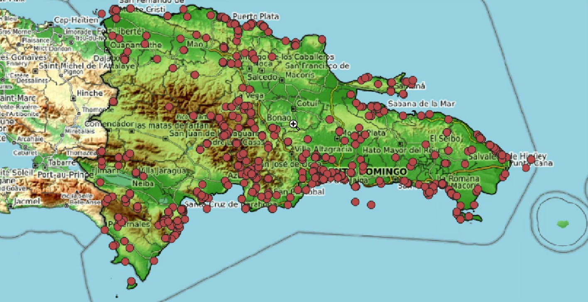

---
output:
  pdf_document:
    keep_tex: true
    fig_caption: true
    latex_engine: pdflatex
    template: svm-latex-ms.tex
    number_sections: true
title: | 
        | Título
        | Subtítulo
        | Subtítulo
author:
- name: Nombre de el/la estudiante
  affiliation: Afiliación, normalmente algo tal que "Estudiante, Universidad Autónoma de Santo Domingo (UASD)"
abstract: "Resumen del manuscrito. No olvides escribirlo aquí dentro de las comillas"
keywords: "palabra clave 1, palabra clave 2"
date: "`r format(Sys.time(), '%B %d, %Y')`"
geometry: margin=1in
fontfamily: mathpazo
fontsize: 11pt
bibliography: references.bib
csl: apa.csl
header-includes:
  \usepackage{pdflscape}
  \newcommand{\blandscape}{\begin{landscape}}
  \newcommand{\elandscape}{\end{landscape}}
  \usepackage{float}
    \floatplacement{figure}{H}
    \floatplacement{table}{H}
  \newcommand{\beginsupplement}{
    \setcounter{table}{0}
    \renewcommand{\thetable}{S\arabic{table}}
    \setcounter{figure}{0}
    \renewcommand{\thefigure}{S\arabic{figure}}
    }
editor_options: 
  chunk_output_type: console
---

# Introducción

\ldots (elimina esta línea)

# Metodología

\ldots (elimina esta línea)

# Resultados

Ver figura \ref{fig:mi_figura}



(ver tabla \ref{tab:mi_tabla})

| Título columna 1 | Título columna 2 | Título columna 2 |
|:-----------------|:----------------:|-----------------:|
| F1C1 (izquierda) | F1C2 (centrado)  |   F1C3 (derecha) |
| F2C1 (izquierda) | F2C2 (centrado)  |   F2C3 (derecha) |

: \label{tab:mi_tabla} PROBANDO

Ver figura \ref{fig:mi_plot_mtcars}

```{r, fig.cap='\\label{fig:mi_plot_mtcars}Mi plot de mtcars'}
plot(pressure)
```

Ver tabla \ref{tab:tabla_mtcars}

```{r}
library(kableExtra)
kable(mtcars[1:10, ], booktabs = T,
      caption = '\\label{tab:tabla_mtcars}Mi tabla de mtcars') %>% 
    kable_classic(full_width = F, html_font = "Cambria")
```

# Discusión  

\ldots (elimina esta línea)

# Agradecimientos

\ldots (elimina esta línea)

# Información de soporte

\ldots (elimina esta línea)

# *Script* reproducible

\ldots (elimina esta línea)

# Referencias
